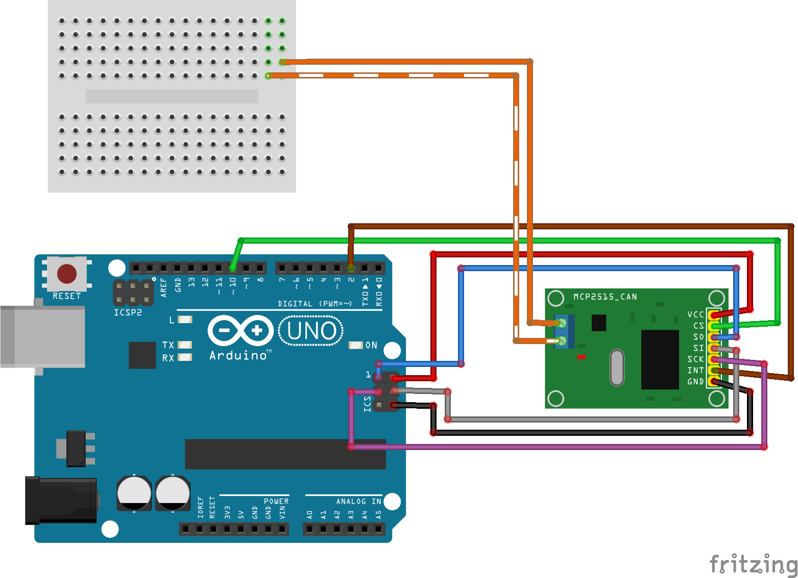

# Step 1

## Description
This example shows the minimal code for Hapcanuino device. 

[Hello World example](https://github.com/Onixarts/Hapcanuino/blob/master/examples/HelloWorld/HelloWorld.ino) device does nothing special. Just tracing Hapcan bus messages to serial COM output. This is good point to start learning the Hapcanuino library.

## Required hardware
For base required hardware see [Hardware requirements](https://github.com/Onixarts/Hapcanuino/wiki/Hardware-requirements)

## Basic setup
After proper MCP CAN module connection to Arduino board and Hapcan bus, load the Sketch into Arduino and connect MCP CAN Module CAN H and CAN L to the Hapcan bus.

MPC CAN module should be connected to SPI interface. Connect INT pin to PIN2 on Arduino, and CS to PIN10. It can be configured (see below).



Here, the MCP CAN module is connected to Arduino using ICSP connector. Two extra wires are connected also to `PIN10` (Chip select) and `PIN2` (Interrupt). 

**Make sure** to connect ICSP to MCP CAN module properly, because there are many different MCP boards available which has different pin locations. The two orange wires are the CAN H and CAN L, which should be connected to Your Hapcan bus.

## First run
In Arduino's Serial port monitor You should see CAN traffic from other Hapcan devices. Something like this:

```
Opening port
Port open
Hapcanuino device starting...
Entering Configuration Mode Successful!
Setting Baudrate Successful!
Frame: 0x303  	Node (3,2)		data: FF FF 87 40 01 FF FF FF 
Frame: 0x308  	Node (4,2)		data: FF FF 02 00 FF 19 00 00 
Frame: 0x303  	Node (3,2)		data: FF FF 07 40 03 FF FF FF 
Frame: 0x302  	Node (2,1)		data: FF FF 04 00 FF FF 08 00 
Frame: 0x303  	Node (3,2)		data: FF FF 87 40 03 FF FF FF 
Frame: 0x303  	Node (3,2)		data: FF FF 07 40 03 FF FF FF 
Frame: 0x302  	Node (2,1)		data: FF FF 04 FF FF FF 08 00 
Frame: 0x303  	Node (3,2)		data: FF FF 87 40 03 FF FF FF 
Frame: 0x303  	Node (3,2)		data: FF FF 07 40 01 FF FF FF 
Frame: 0x303  	Node (3,2)		data: FF FF 87 40 01 FF FF FF 
Frame: 0x308  	Node (4,2)		data: FF FF 02 FF FF 19 00 00 
```

You can now open Hapcan Programmer and search for new Hapcanuino device, and configure, group, node, description.

Hapcanuino device should be visible by [Hapcan programmer](http://hapcan.com/software/hap/) software already. The device hardware version will be displayed as Hapcanuino (next to original UNIV 1, UNIV 3 devices).

## Code explanation

First You need to include Onixarts_Hapcanuino library.
```C++
#include "HapcanDevice.h"
```

Hapcanuino library uses C++ namespaces to arrange code, so declare using a `Onixarts::HomeAutomationCore` namespace. This line will tell compiler to look into this namespace to find classes and other types.

```C++
using namespace Onixarts::HomeAutomationCore;
```

Next, declare a HapcanDevice class object

```C++
Hapcan::HapcanDevice hapcanDevice;
```

Now, it's time to configure Your device. You need to provide some device describing parameters to distinguish different devices from each other in Hapcan's network. This parameters are stored in constants grouped in namespaces declared in Hapcanuino library. Just put valid values for each parameter. 

```C++
const byte Hapcan::Config::MCP::InterruptPin = 2;				// CAN module interrupt is connected to this pin (see https://www.arduino.cc/en/Reference/AttachInterrupt)
const byte Hapcan::Config::MCP::CSPin = 10;						// SPI CS pin
const byte Hapcan::Config::MCP::OscillatorFrequency = MCP_8MHZ;	// MCP oscillator frequency on MCP CAN module (or MCP_16MHz)

const byte Hapcan::Config::Hardware::DeviceId1 = 0x12;			// unique device identifier 1, change it
const byte Hapcan::Config::Hardware::DeviceId2 = 0x34;			// unique device identifier 2, change it

const byte Hapcan::Config::Node::SerialNumber0 = 9;				// ID0 serial number MSB
const byte Hapcan::Config::Node::SerialNumber1 = 9;
const byte Hapcan::Config::Node::SerialNumber2 = 32;			// this is also a default node
const byte Hapcan::Config::Node::SerialNumber3 = 9;				// this is also a default group

const byte Hapcan::Config::Firmware::ApplicationType = 51;		// application (hardware) type (such as button, relay, dimmer) 1-10 Hapcan modules, 102 - ethernet, 51 - Hapcanuino Hellow World
const byte Hapcan::Config::Firmware::ApplicationVersion = 0;	// application (hardware) version, change this value each time You make some changes in device hardware
const byte Hapcan::Config::Firmware::FirmwareVersion = 1;		// firmware version
const int Hapcan::Config::Firmware::FirmwareRevision = 0; // firmware revision
```
You can find detailed information about each constant in [[Configuring hardware]] topic.

In `setup()` function the only required method is `hapcanDevice.Begin()`.

```C++
void setup()
{
    Serial.begin(115200);
    Serial.println("Hapcanuino device starting...");

    // initializing Hapcanuino device
    hapcanDevice.Begin();
}
```

Finally the `loop()` function should call `hapcanDevice.Update()` method.

```C++
void loop()
{
    hapcanDevice.Update();
}
```

One thing You should avoid is to put `delay()` function inside `loop()`, because that will cause Hapcanuino stops processing the incomming messages. The `loop()` function should be called as frequent as possible.

If You need to run some other tasks with some longer period consider using [Onixarts TaskManager](https://github.com/Onixarts/Onixarts_TaskManager) or other Onixarts Arduino libraries. All these libraries share the same concept - no delaying in `loop()` function, just `Update()` all the objects.

## Next step
The next step, is to make our device reacts on controling messages in [[Direct control]] example.