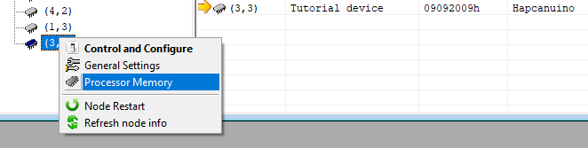
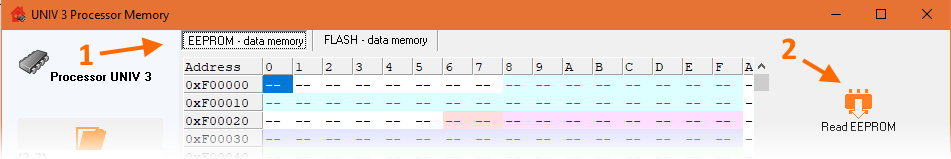
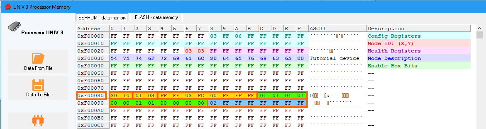

# Step 4

## Description
This example will show You how to link device with external Hapcan hardware to control the LED 7.

[Indirect control example](https://github.com/Onixarts/Hapcanuino/blob/master/examples/IndirectControl/IndirectControl.ino) device will allows You to control LED connected to Arduino `PIN7` using indirect control - known also as box programming.

## Required hardware
For base required hardware see [Hardware requirements](https://github.com/Onixarts/Hapcanuino/wiki/Hardware-requirements)

## Setup
This example use the same circuit as [[Direct Control]] example.

## What is indirect control?

In [[Direct-Control]] example we've been using direct control message to call the `ExecuteInstruction()` function. This function was called by Hapcanuino core and there was `Hapcan::InstructionStruct` passed as an function argument, so the device can perform an action specified by the instruction received. This instruction was send by the computer (Hapcan programmer). 

Indirect control allows You to program device remotely so it can execute instruction after receiving any message from other modules in CAN bus. For example, we are going to control LED with external button module.

## Code explanation

Well, the code for this example is the same as in previous step, because when You implement `ExecuteInstruction()` function the device already can handle indirect control.

## Programming boxes

Let's go to the Hapcan programmer then, because it will be used for programming boxes. 

Select the Hapcanuino device and choose Processor memory option from context menu.



The memory window shows up. Switch to **EEPROM - data memory** (1) and push **Read EEPROM** (2) button. Wait for process to complete.



In the Serial monitor You should see memory reading frames, like:

```
Frame: 0x100  	Node (240,240)		data: FF FF 03 03 FF FF FF FF 
> Entering programming mode
Frame: 0x100 A	Node (3,3)		data: FF FF 01 00 FF FF FF FF 
Frame: 0x030  	Node (3,3)		data: F0 00 00 FF FF 01 FF FF 
> Address frame
Frame: 0x030 A	Node (3,3)		data: F0 00 00 FF FF 01 FF FF 
Frame: 0x040  	Node (3,3)		data: FF FF FF FF FF FF FF FF 
> Data frame
Frame: 0x040 A	Node (3,3)		data: FF FF FF FF FF FF FF FF 
Frame: 0x030  	Node (3,3)		data: F0 00 08 FF FF 01 FF FF 
> Address frame
Frame: 0x030 A	Node (3,3)		data: F0 00 08 FF FF 01 FF FF 
Frame: 0x040  	Node (3,3)		data: FF FF FF FF FF FF FF FF 
> Data frame
Frame: 0x040 A	Node (3,3)		data: 03 FF 06 FF FF FF FF FF 
```

For now, there is no dedicated box programming support in Hapcan programmer, so we have to use the hex EEPROM editor.

As shown in [Hapcanuino memory excel file](https://github.com/Onixarts/Hapcanuino/blob/master/docs/Hapcanuino_1-50-0-0-memory.xlsx) there are 28 boxes in 1kB EEPROM, starting on virtual adress of 0xF00080. This virtual Hapcan address is mapped to Arduino EEPROM memory, starting at 0x0080.

The box structure is describe in [[Configuring-device]] topic and in excel file. One box is 32 bytes long structure, which contains 3 areas:

- **activation frame (filter)** is a 12 bytes long Hapcan's frame, that will be used as a filter value. It is for example the button message sent by button module after You press the button :).
- **operators** is also a 12 bytes long opearators definition for the each byte in activation frame. For example, it specifies if values of received message has to be the same, different, ignored, less than or grater than the value specified in activation frame. This allows You to react on any single message in the CAN bus or even for range of messages, sent by cpecified module for example.
- **Instruction and params** has 8 bytes long and contains the same instruction as provided by direct control. This params will be passed to the `ExecuteInstruction()` function when received CAN frame will match activation frame values with operators applied.

### Get the button message

You can create message using the Hapcan button module manual, but it is simplier using the bus monitor (this on Hapcan programmer or in Hapcanuino serial port).

Push the desired button, that will toggle the `LED7`. In bus monitor the button message will shows:

```
Frame: 0x301  	Node (1,3)		data: FF FF 03 FC 00 FF FF FF
```

Frame 0x301 is the button status message, from node (1,3) in my case. In frame's data section there is third byte set to `0x03` which means **channel**. Next byte with value of `0xFC` means **closed and open within 400ms**. Next byte is an internal module LED status, which is not important in this example.

So we put this message as an activation frame, starting with `0x30 0x10`. Why not `0x03 0x01` You may ask. That's because in Hapcan modules there is a 4 bit shift in CAN message ID and the modules use lower part of the second byte as answer flag. So the answer for `0x3010` is `0x3011`.

Below is the screen presents the whole box definition for this button message, executing toggle `LED7` instruction.



**Yellow part** is the activation frame (whole button frame).

**Green part** is the operators definition for each activation frame byte. First 4 bytes are set to `0x01` which means that the first 4 bytes of received message must be equal to these in activation frame (message type `0x301` and sender node (1,3). Next two bytes may be ignored, so `0x00` operator is used. Then we want, to our device only react when button module send short click (`0xFC`) on button 3 (`0x03`). So again, we use `0x01` equality operator for these bytes. Other bytes may be ignored.

**Blue part** is the instruction passed to the `ExecuteInstruction()` function, so we put here just value of `0x02` - which means toggle as we defined it earlier in function body.

After setting up a box, upload the changes to the processor and it should work.

Serial port monitor after button 3 short click.

```
Frame: 0x301  	Node (1,3)		data: FF FF 03 FC 00 FF FF FF 
> Accepted box: 1 instr: 2
Frame: 0x302  	Node (3,3)		data: FF FF 01 FF FF FF FF FF 

Frame: 0x301  	Node (1,3)		data: FF FF 03 FC 00 FF FF FF 
> Accepted box: 1 instr: 2
Frame: 0x302  	Node (3,3)		data: FF FF 01 00 FF FF FF FF 
```
After received `0x301` button message from node (1,3) Hapcanuino accepts the box 1 and calls instruction 2. Our device also send `0x302` frame as the `LED7` changes its status (toggles).

Same technique can be used to set up all other boxes and calls different instructions on other message received.

## Next step

You can already build simple devices with this knowledge, but wait.. there's more ;). More means less in this case. With submodules You can create devices firmware much quicker, even without knowledge of Hapcan frames structure. Let's jump into [[submodule]] example.