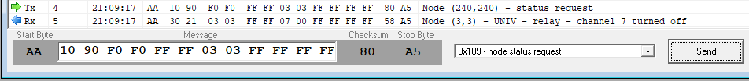
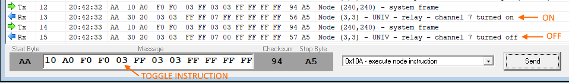

# Step 3

## Description
This example will send message to Hapcan bus after receiving status request message and after device change its state (LED 7).

[Status request example](https://github.com/Onixarts/Hapcanuino/blob/master/examples/StatusRequest/StatusRequest.ino) device will allows You to control LED connected to Arduino `PIN7` using Hapcan's direct control message. Device will also respond to status request message and will notify other modules when LED change its state.

## Required hardware
For base required hardware see [Hardware requirements](https://github.com/Onixarts/Hapcanuino/wiki/Hardware-requirements)

## Setup
This example use the same circuit as [[Direct Control]] example.

## How status request works?

Hapcanuino will fire an event after receiving status request message (0x109). You can attach Your own function to this event so You can check Your device current status and send appropriate message(s). Yes, device can send multiple messages on status request, so the master device can receive full status information about Your device.

This callback function can also be used, to send right message when Your device changes its state, for example on LED changed, button pushed, temperature changed etc.

## Code explanation

As we defined `ExecuteInstruction()` callback in previous example, now let's add special callback for handling status send.

```C++
// Callback function for status request handling
void SendStatus(byte requestType, bool isAnswer);
```
Again, the function name does not matter.

In `setup()` function register this callback by calling the `SetStatusRequestDelegate()` function.

```C++
// set callback function to be called when Hapcanuino receives status request message or module change its state
hapcanDevice.SetStatusRequestDelegate(SendStatus);
```

Next, add a callback function definition:

```C++
void SendStatus(byte requestType, bool isAnswer)
{
	// check if we should send informations about all the functions in module
	bool sendAll = requestType == Hapcan::Message::System::StatusRequestType::SendAll;

	// if we need send all info or just LED7Info status
	if (sendAll || requestType == StatusRequestType::LED7Status)
	{
		// Prepare a standard Hapcan's Relay Message (0x302)
		// Use isAnswer variable here, because it will be set to true when it is a response for StatusRequest message (0x109)
		Hapcan::HapcanMessage statusMessage(Hapcan::Message::Normal::RelayMessage, isAnswer);
		statusMessage.m_data[2] = 7;	// set up byte 3 as channel 7
		statusMessage.m_data[3] = digitalRead(PIN7) == LOW ? 0x00 : 0xFF; // set byte 4 (status, 0x00 = LED OFF, 0xFF = LED ON
		hapcanDevice.Send(statusMessage);
	}
}
```

Function receives two parameters:

**requestType** - this parameter allows You to decide which status should be send. When status request message is received the Hapcanuino core will call this function passing value of `Hapcan::Message::System::StatusRequestType::SendAll` which is simply a 0 value. This means, You should send all device statuses. When You call this function directly You can pass any other value so the function send only specific status, for example in module with 10 buttons You can send only one button message for pushed button.

**isAnswer** - this value indicates that all sending status messages should be marked as answer for status request (0x109).

In `ExecuteInstruction()` function we also have to call `SendStatus()` function, but only when LED state has changed.

```C++
void ExecuteInstruction(Hapcan::InstructionStruct& exec, Hapcan::HapcanMessage& message)
{
	// read the initial LED state
	int initialState = digitalRead(PIN7);
	
	//...
	// here is a previous switch statement
	//...

	// check, if LED changes its state and send message to Hapcan bus
	if (initialState != digitalRead(PIN7))
	{
		// send status frame after change of LED7 to notify other Hapcan modules. 
		// Notice second (isAnswer) parameter is set to false, because we call it directly after status change, so it is not an answer for status request
		SendStatus(StatusRequestType::LED7Status, false);
	}
}
```

### Runtime

Let's send status request message to module (3,3) - it might be other group and node number in Your system.



As You can see in monitor window, I have sent status request message (0x109), and the device response with current LED status. You can send any message, but it is good to send standarized Hapcan messages like relay message, button message, temp message as long as data stored in message are standarized. If You do that, the Hapcan programmer will recognize this message and display it in human friendly manner.

In Arduino serial monitor You can see the same log as in Hapcan monitor.

```
Frame: 0x109  	Node (240,240)		data: FF FF 03 03 FF FF FF FF 
> StatusRequest
Frame: 0x302 A	Node (3,3)		data: FF FF 07 00 FF FF FF FF 
```

How about, we use direct control message and toggle the LED ON and OFF. The device should send proper status message each time LED toggle occured.



## Next step

So we know how to use direct control and send device status to Hapcan bus. This knowledge should be enough to allows You to create a simple device. In the next step I will show You how to execute instruction based on configuration BOXes - that will allows You to really program Your device and link it with the other devices without need of  reprogramming flash memory with IDE. Go to next step - the [[Indirect control]].